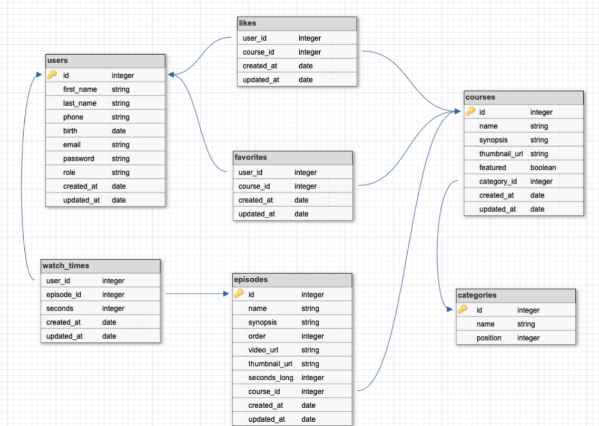

# 🧩 Modelo do Banco de Dados

Este diagrama ER (Entidade-Relacionamento) representa a estrutura atual do banco de dados da aplicação. Ele cobre os relacionamentos entre usuários, cursos, episódios, favoritos, tempo assistido, entre outros.

## 🗂️ Tabelas principais

### users
- Armazena os dados do usuário (nome, email, senha, etc.)
- Campo `role` diferencia usuário comum de administrador

### courses
- Representa cada curso da plataforma
- Relacionado a `categories` por `category_id`
- Pode ser destacado com `featured: boolean`

### episodes
- Pertencem a um curso via `course_id`
- Possuem ordem, vídeo e duração

### watch_times
- Registra quanto tempo de um episódio um usuário assistiu
- Serve para a funcionalidade "continuar de onde parei"

### favorites / likes
- Tabelas auxiliares para registrar cursos favoritados ou curtidos por usuários

### categories
- Define categorias para agrupar cursos
- Campo `position` pode ser usado para ordenação

## 🛠️ Considerações futuras

- Validar se a tabela `likes` é realmente necessária ou se pode ser fundida com `favorites`
- Criar uma tabela de progresso por curso completo (opcional)
- Adicionar indexação para melhorar performance nas tabelas de relacionamento

> Este modelo pode evoluir conforme novas funcionalidades forem implementadas.
