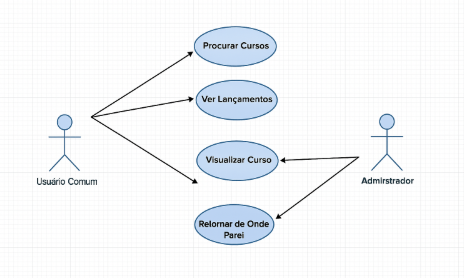

---

## 🎯 Diagrama de Casos de Uso

A imagem abaixo representa visualmente os principais casos de uso da aplicação, tanto para o usuário comum quanto para o administrador.

- O usuário comum pode:
  - Procurar cursos
  - Ver lançamentos
  - Visualizar cursos
  - Continuar de onde parou

- O administrador pode:
  - Destacar cursos
  - Visualizar conteúdo
  - Gerenciar categorias e cursos (funções ainda serão mapeadas visualmente)

> Este diagrama será atualizado conforme novas funcionalidades forem adicionadas ao projeto.

---